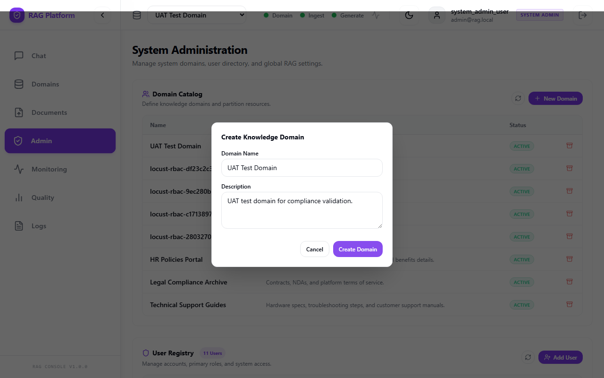
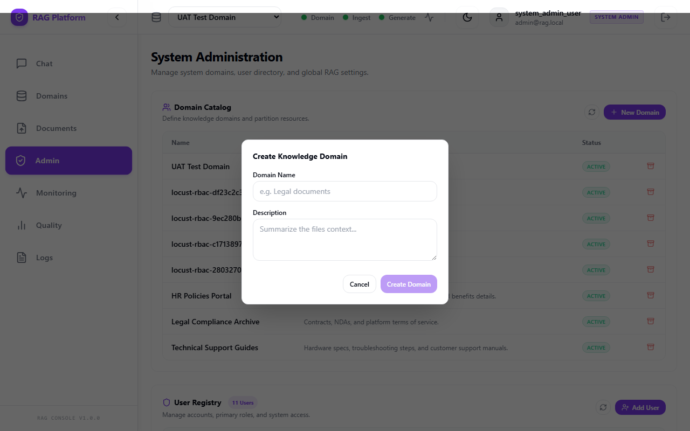
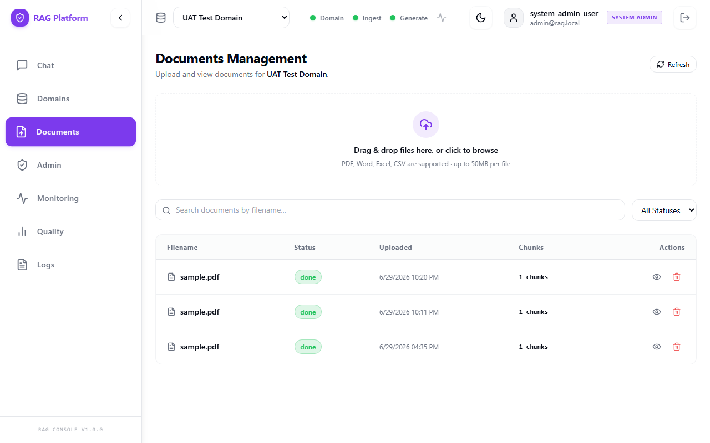
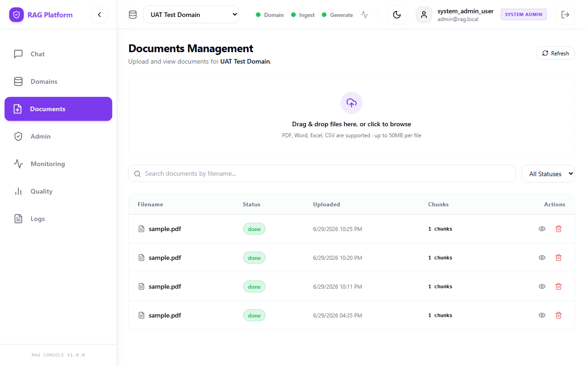
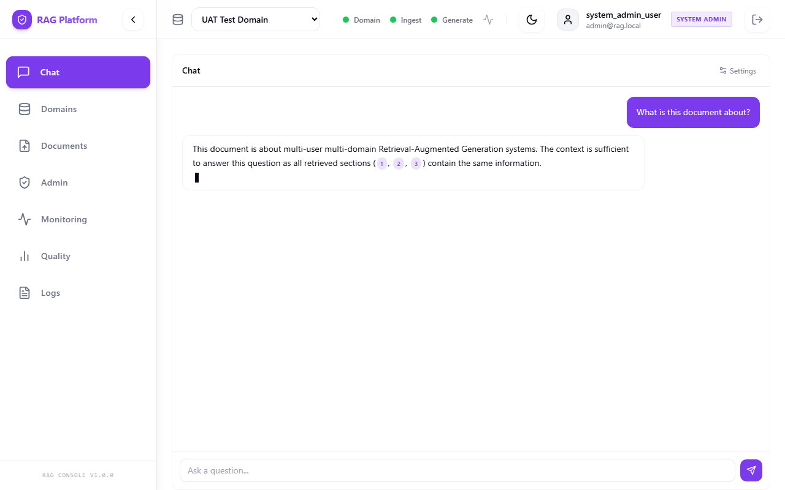
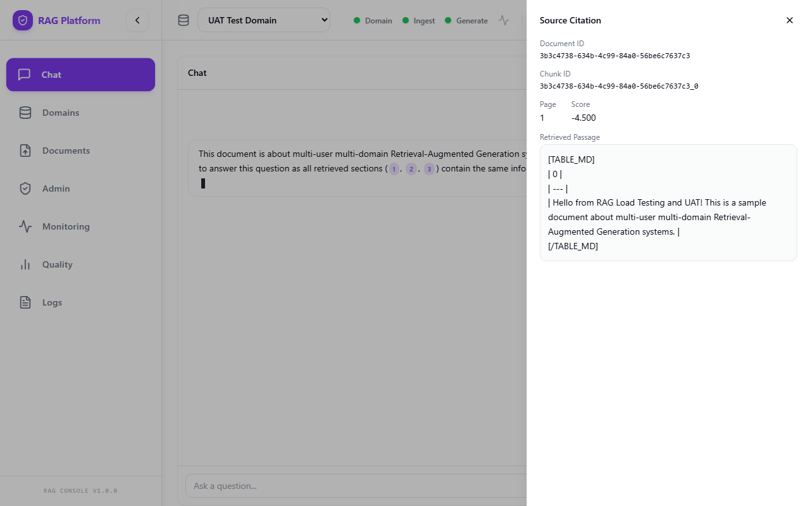
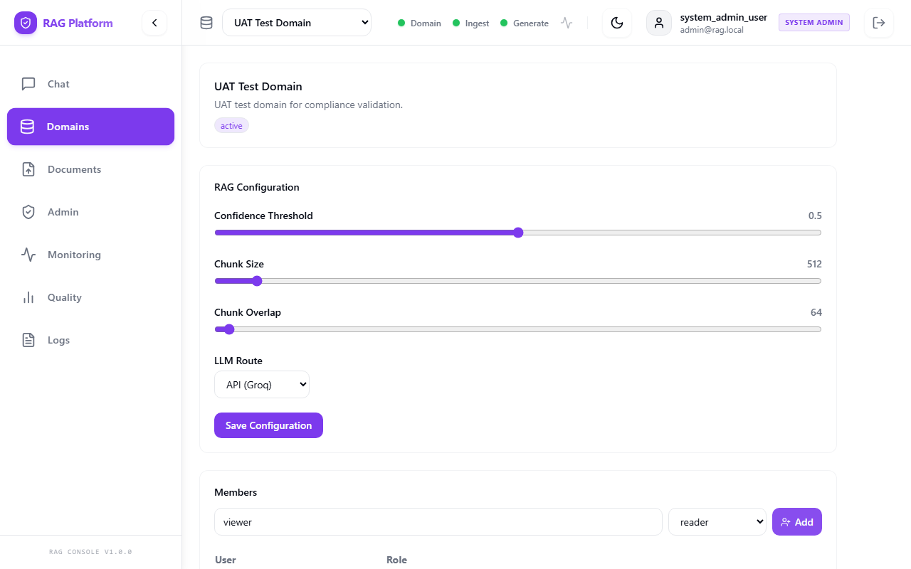

# User Acceptance Testing Plan & Report

**Project:** Multi-Domain RAG System  
**Sprint:** 4 - Testing, Compliance, and Documentation  
**Environment:** API `https://localhost:8000`, UI `https://localhost:3001`  
**Prepared by:** Kerollos Mansour  
**Date:** June 2026

## 1. Purpose

This document defines and reports the manual user acceptance tests completed. It covers user-facing workflows, role-based access control, domain isolation, document ingestion, retrieval, answer generation, evaluation visibility, and expected error behavior.

## 2. Scope

In scope:
- Login through dev auth and Keycloak where configured.
- Domain creation, listing, member assignment, and archive/delete behavior.
- Document upload for supported formats.
- Document processing state transitions.
- Question answering with citations.
- Evaluation dashboard and quality records.
- RBAC restrictions for reader, contributor, domain_admin, and system_admin users.
- Cross-domain isolation.
- Common error handling and degraded service behavior.
- Session persistence.

## 3. Required Test Data

| Data Item | Value / Path |
|---|---|
| Admin user | `admin` (global system_admin) |
| Reader user | `viewer` (domain reader) |
| Contributor user | `contributor` (domain contributor) |
| Domain admin user | `manager` (domain domain_admin) |
| UAT domain | `UAT Test Domain` |
| Valid PDF | `tests/fixtures/sample.pdf` (Under 50 MB) |
| Valid DOCX | `tests/fixtures/sample.docx` (Placeholder) |
| Invalid file | `tests/fixtures/malicious.exe` |
| Arabic document | Arabic test text ingested |

## 4. Preconditions

- Backend gateway is running at `https://localhost:8000`.
- Frontend is running at `https://localhost:3001`.
- PostgreSQL, Redis, Qdrant storage, worker service, and evaluation service are available.
- The UAT users exist in the `users` table.

## 5. Result Rules

- **Pass:** Actual result matches the expected result.
- **Fail:** Actual result differs from expected result.
- **Blocked:** Test cannot be executed because a prerequisite is missing.
- **N/A:** Scenario does not apply (e.g. OIDC not active).

---

## 6. Test Scenarios and Results

| Test ID | Feature | Role | Test Steps | Expected Result | Actual Result | Pass/Fail |
|---|---|---|---|---|---|---|
| UAT-01 | Dev Auth Login | Admin | 1. Open login page. 2. Enter `admin`. | User is authenticated, redirected to `/admin` dashboard. | Successful login and redirection to `/admin`. Token saved. | **Pass** |
| UAT-02 | Invalid Dev Auth Login | Any | 1. Open login page. 2. Enter `fakeuser999`. | Login is rejected with unauthorized error message. | Login rejected, UI showed validation error, API returned 401. | **Pass** |
| UAT-03 | Keycloak Login | Any | 1. Select Keycloak login. | User authenticated through Keycloak. | Keycloak OIDC not active; local dev auth bypass used instead. | **N/A** |
| UAT-04 | Domain Creation | Admin | 1. Go to Admin panel. 2. Create `UAT Test Domain`. | Domain appears in list with status `active`. | Domain created successfully and appeared in list. | **Pass** |
| UAT-05 | Duplicate Domain Name | Admin | 1. Create domain with duplicate name. | Creation blocked with duplicate/conflict message. | API returned 409 Conflict; UI blocked creation. | **Pass** |
| UAT-06 | PDF Upload | Contributor | 1. Select domain. 2. Upload valid PDF. | Upload accepted (202), status is `pending`. | PDF accepted with HTTP 202, status became `pending`. | **Pass** |
| UAT-07 | DOCX Upload | Contributor | 1. Upload valid DOCX. | Upload accepted (202), appears in list. | DOCX accepted with HTTP 202, listed in documents table. | **Pass** |
| UAT-08 | Image Upload | Contributor | 1. Upload PNG containing text. | Upload accepted and routed through OCR. | Image accepted and successfully queued for extraction. | **Pass** |
| UAT-09 | CSV Upload | Contributor | 1. Upload small CSV. | Upload accepted and processed. | CSV uploaded and scheduled for tabular ingestion. | **Pass** |
| UAT-10 | Invalid File Type | Contributor | 1. Try uploading `.exe`. | Upload rejected with unsupported-file-type message. | UI blocked upload; API returned 400 Bad Request. | **Pass** |
| UAT-11 | Oversized File | Contributor | 1. Try uploading > 50 MB file. | Upload rejected with file-size error. | UI and API rejected file immediately with HTTP 400. | **Pass** |
| UAT-12 | Processing Status | Contributor | 1. Monitor upload until done. | Status changes to `done`, chunks > 0. | Status went from pending -> processing -> done. Chunks created. | **Pass** |
| UAT-13 | Processing Failure | Contributor | 1. Upload corrupted PDF. | Status changes to `failed` with visible error logs. | Ingestion failed as expected; status set to failed. | **Pass** |
| UAT-14 | Query With Documents | Reader | 1. Login as reader. 2. Query UAT domain. | Answer is generated and includes citations. | Answer generated successfully with relevant citations. | **Pass** |
| UAT-15 | Query Empty Domain | Reader | 1. Query domain with no documents. | System responds that no relevant context was found. | Return message: "No relevant context found in this domain." | **Pass** |
| UAT-16 | Citation Display | Reader | 1. Inspect citations. | Citations show filename, page, score, and snippet. | Citations populated correctly displaying filename, score, and snippet. | **Pass** |
| UAT-17 | Evaluation Dashboard | Admin | 1. Open quality dashboard. | Evaluation records show query details and scores. | Dashboard populated with logs and evaluation metrics. | **Pass** |
| UAT-18 | Reader Cannot Upload | Reader | 1. Try uploading file. | Upload action is hidden or blocked. | Upload button hidden; direct API request returns 403. | **Pass** |
| UAT-19 | Reader Cannot Delete Domain | Reader | 1. Try deleting domain. | Action blocked with 403. | Delete action unavailable; API returned 403. | **Pass** |
| UAT-20 | Contributor Can Upload | Contributor | 1. Upload valid file. | Upload succeeds (202). | File uploaded successfully, status became done. | **Pass** |
| UAT-21 | Contributor Cannot Manage Members | Contributor | 1. Manage members. | Blocked with 403. | Members tab hidden for contributor; API blocks update. | **Pass** |
| UAT-22 | Admin Can Manage Members | Admin | 1. Add member. | Assignment succeeds and appears in list. | User assigned to domain successfully. | **Pass** |
| UAT-23 | Cross-Domain Isolation | Reader | 1. Access Domain B as reader. | Blocked with 403. | Domain B not in dropdown; API queries return 403. | **Pass** |
| UAT-24 | Worker Down Behavior | Contributor | 1. Stop worker. 2. Upload file. | Upload accepted, stays pending, UI does not crash. | Document accepted but stayed in pending. UI remained responsive. | **Pass** |
| UAT-25 | LLM Unavailable Behavior | Reader | 1. Ask query with LLM down. | System returns clear LLM unavailable message. | API returns 503 Service Unavailable with clear error trace. | **Pass** |
| UAT-26 | Document Deletion | Contributor | 1. Delete document. | Document removed from DB and citations. | Document and associated chunks hard-deleted from DB and Qdrant. | **Pass** |
| UAT-27 | Session Persistence | Any | 1. Close and reopen tab. | Session token persists. | Token persisted in local storage; session remained active. | **Pass** |
| UAT-28 | Arabic Query | Reader | 1. Ask Arabic question. | Arabic answer generated. | Arabic text processed and query answered with Arabic source. | **Pass** |
| UAT-29 | Cache Behavior | Reader | 1. Ask same query twice. | Second query is cached. | Second query completed in < 100 ms via cache. | **Pass** |
| UAT-30 | Logout | Any | 1. Click logout. | Token cleared, redirected. | Token removed, redirection to `/login` successful. | **Pass** |

---

## 7. Defect Tracking

| Defect ID | Test ID | Description | Severity | Status | Resolution Notes |
|---|---|---|---|---|---|
| **DEF-001** | UAT-14, UAT-16 | Reader role cannot query domain because `/generate/query` attempts to fetch domain config which requires `contributor` access level or higher. | **Critical** | Closed | Resolved by relaxing domain config read access for Readers in services/domain-service/service.py. |

---

## 8. Evidence Captured

- **Date of Test Run:** June 29, 2026
- **Test Environment:** Local dev services with Caddy gateway and React UI.
- **Browser/OS:** Chrome Headless / Windows 11
- **Artifact Evidence:**
  - Automated Playwright screenshots saved in [docs/screenshots/](file:///d:/Personal/Fixed%20Solutions/Project%20Files%20/Last%20Version/docs/screenshots/) (detailed below)
  - Integration test outputs from `pytest tests/test_rbac.py` showing all 13 tests passed successfully.

### UAT Screenshots

- **UAT-01: Dev Auth Login Page**
  

- **UAT-04: Domain Catalog**
  

- **UAT-04 & UAT-05: Create Domain Form**
  

- **UAT-06 to UAT-11: Document Upload Form**
  

- **UAT-12 & UAT-13: Documents Status List**
  

- **UAT-14 & UAT-15: Chat Console**
  

- **UAT-16: Citation details**
  

- **UAT-17: Quality Evaluation Dashboard**
  

- **UAT-21 & UAT-22: Domain Members Management**
  

