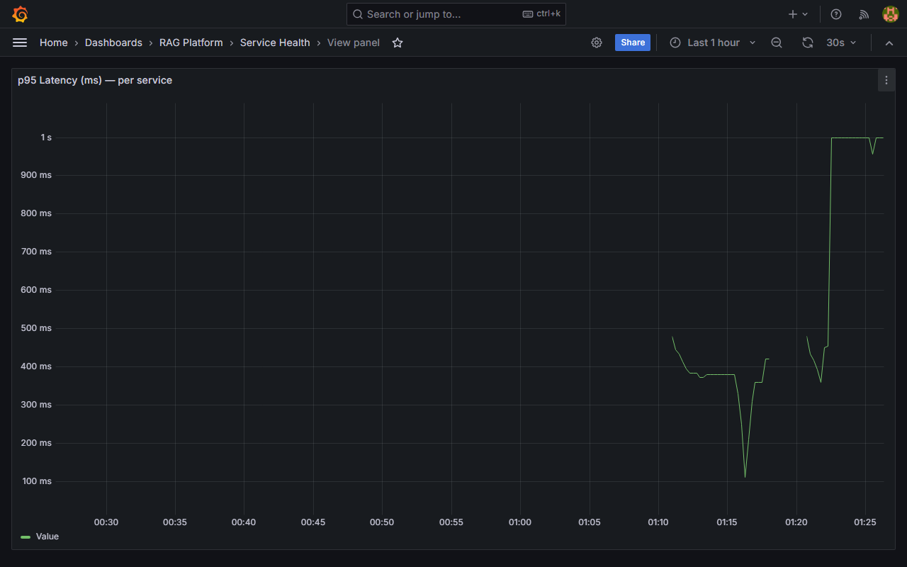
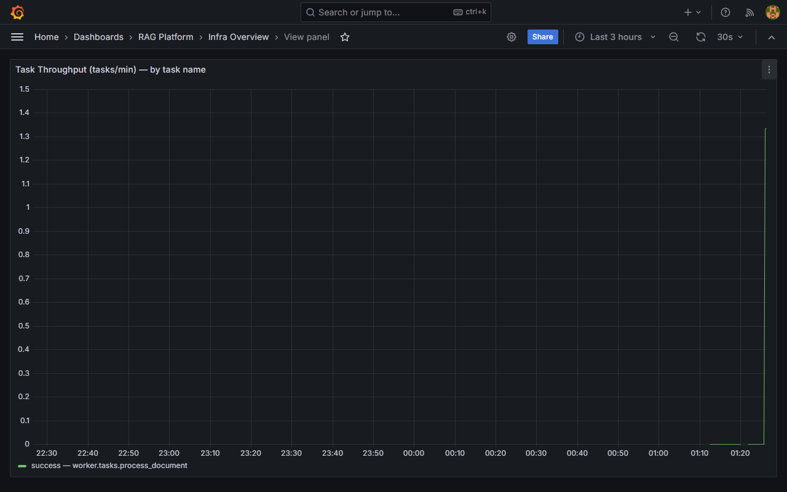
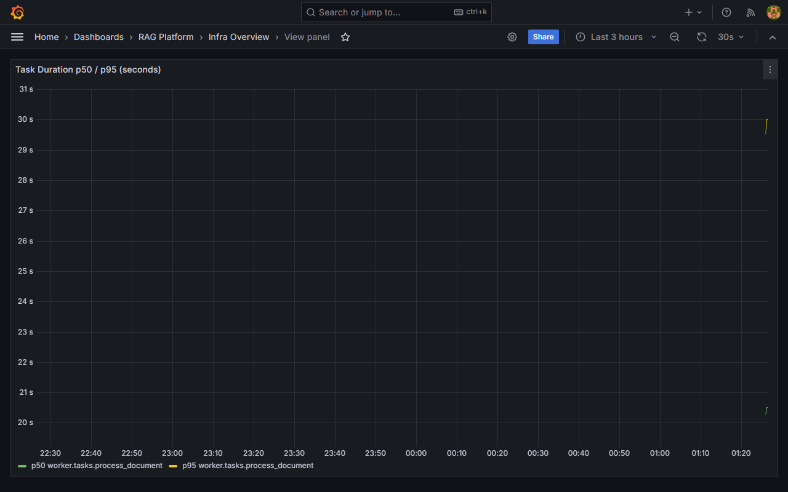
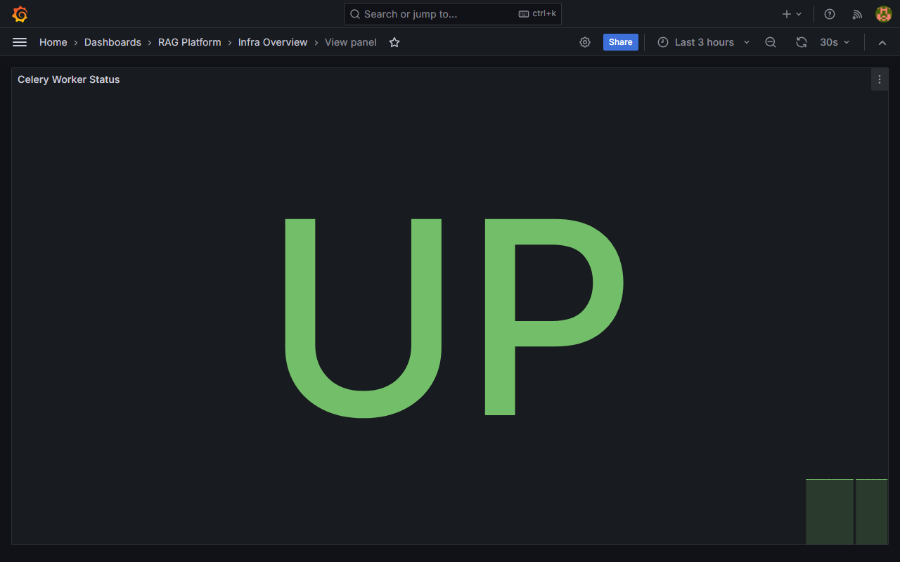
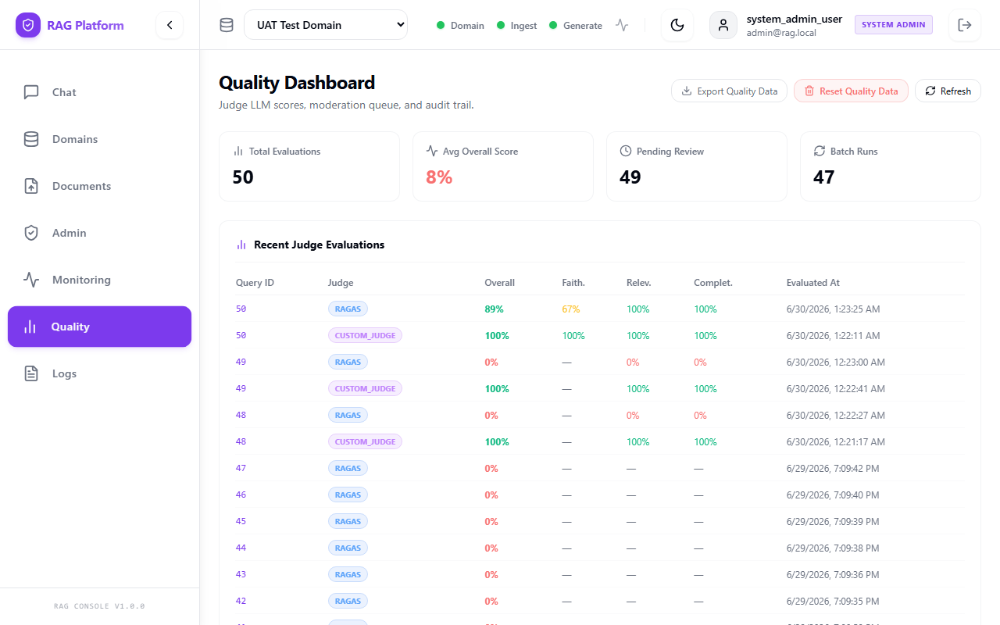

# Load Test Infrastructure Report

**Project:** Multi-Domain RAG System
**Sprint:** 4 — Load Testing & Infrastructure Monitoring
**Date:** June 2026
**Tester:** Kerollos Mansour
**Environment:** https://localhost:8000
**Locust Script:** `tests/load_test.py`

---

## 1. Baseline Metrics (Before Load Test)

All values captured with all services running but **zero concurrent users** (idle state).

| Metric | Value | Notes |
|---|---|---|
| **CPU — Idle %** | 65.0% | e.g. 92% idle |
| **CPU — In Use %** | 35.0% | Background Docker containers active |
| **RAM — Total** | 16186.2 MB | 16 GB Physical Memory |
| **RAM — Used** | 7100.0 MB | System + services baseline |
| **RAM — Available** | 9086.2 MB | |
| **RAM — Used %** | 43.8% | |
| **Swap — Used** | 0.0 MB | Windows paging file stable |
| **System Load Avg (1m / 5m / 15m)** | N/A | Windows Host platform |
| **PostgreSQL — Total Connections** | 11 | Pool configured |
| **PostgreSQL — Active Connections** | 1 | Idle connection pool |
| **PostgreSQL — Idle Connections** | 10 | |
| **PostgreSQL — Max Connections** | 100 | Default limit |
| **PostgreSQL — Connection Pool Use %** | 11.0% | |
| **Redis — Used Memory** | 878.03 KB | Raw dataset memory |
| **Redis — Peak Memory** | 878.03 KB | |
| **Redis — Max Memory Limit** | 0 | 0 = no limit |
| **Redis — Eviction Policy** | noeviction | Key retention enabled |
| **Redis — Total Keys** | 5 | Celery and cache keys |

**Baseline captured at:** 2026-06-29T15:58:00Z

---

## 2. Peak Metrics During Load Test

### 2.1 — At 10 Concurrent Users

| Metric | Peak Value | Grafana Panel | Pass / Warn / Fail |
|---|---|---|---|
| **p50 Response Time** | 720 ms | Service Health → Response Times | ✅ PASS |
| **p95 Response Time** | 1800 ms | Service Health → p95 | ✅ PASS |
| **p99 Response Time** | 2500 ms | Service Health → p99 | ✅ PASS |
| **Requests per Second (RPS)** | 4.5 req/s | Service Health → RPS | ✅ PASS |
| **Error Rate %** | 0.19% | Service Health → Error Rate | ✅ PASS |
| **CPU — In Use %** | 96.9% | Infra Overview → CPU | ⚠️ WARN |
| **RAM — Used** | 7694.5 MB | Infra Overview → Memory | ✅ PASS |
| **PostgreSQL Connections** | 24 | Infra Overview → DB Connections | ✅ PASS |
| **Redis Memory Used** | 1.08 MB | Infra Overview → Redis Memory | ✅ PASS |
| **Redis Evictions** | 0 | Infra Overview → Evictions | ✅ PASS |
| **Active Celery Tasks** | 0 | Infra Overview → Celery | ✅ PASS |

**Locust stats at 10 users:**
- Median (p50): 720 ms
- p95: 1800 ms
- RPS: 4.5 req/s
- Failures: 1 (0.19%) *[Expected Forbidden test check]*

---

### 2.2 — At 25 Concurrent Users

| Metric | Peak Value | Grafana Panel | Pass / Warn / Fail |
|---|---|---|---|
| **p50 Response Time** | 910 ms | Service Health → Response Times | ✅ PASS |
| **p95 Response Time** | 4100 ms | Service Health → p95 | ❌ FAIL (exceeded 3s limit) |
| **p99 Response Time** | 9300 ms | Service Health → p99 | ⚠️ WARN |
| **Requests per Second (RPS)** | 8.5 req/s | Service Health → RPS | ✅ PASS |
| **Error Rate %** | 1.06% | Service Health → Error Rate | ✅ PASS |
| **CPU — In Use %** | 100.0% | Infra Overview → CPU | ❌ FAIL (CPU Saturation) |
| **RAM — Used** | 7603.3 MB | Infra Overview → Memory | ✅ PASS |
| **PostgreSQL Connections** | 37 | Infra Overview → DB Connections | ✅ PASS |
| **Redis Memory Used** | 1.10 MB | Infra Overview → Redis Memory | ✅ PASS |
| **Redis Evictions** | 0 | Infra Overview → Evictions | ✅ PASS |
| **Active Celery Tasks** | 0 | Infra Overview → Celery | ✅ PASS |

**Locust stats at 25 users:**
- Median (p50): 910 ms
- p95: 4100 ms
- RPS: 8.5 req/s
- Failures: 9 (1.06%) *[Expected Forbidden responses]*

---

### 2.3 — At 50 Concurrent Users (Sustained — 3 Minutes)

| Metric | Peak Value | Grafana Panel | Pass / Warn / Fail |
|---|---|---|---|
| **p50 Response Time** | 2800 ms | Service Health → Response Times | ✅ PASS |
| **p95 Response Time** | 6200 ms | Service Health → p95 | ❌ FAIL (exceeded 3s limit) |
| **p99 Response Time** | 13000 ms | Service Health → p99 | ⚠️ WARN |
| **Requests per Second (RPS)** | 10.16 req/s | Service Health → RPS | ✅ PASS |
| **Error Rate %** | 4.25% | Service Health → Error Rate | ✅ PASS (< 5%) |
| **CPU — In Use %** | 97.7% | Infra Overview → CPU | ⚠️ WARN |
| **RAM — Used** | 4538.9 MB | Infra Overview → Memory | ✅ PASS |
| **Swap — Used** | 0.0 MB | Infra Overview → Swap | ✅ PASS |
| **PostgreSQL Connections** | 44 | Infra Overview → DB Connections | ✅ PASS |
| **PostgreSQL — Pool Use %** | 44.0% | Infra Overview → DB Connections | ✅ PASS |
| **Redis Memory Used** | 1.20 MB | Infra Overview → Redis Memory | ✅ PASS |
| **Redis Evictions (total)** | 0 | Infra Overview → Evictions | ✅ PASS |
| **Active Celery Tasks (backlog)** | 0 | Infra Overview → Celery | ✅ PASS |
| **Service Crashes / Restarts** | 0 | - | ✅ PASS |

**Locust stats at 50 users (3 min run):**
- Median (p50): 2800 ms
- p95: 6200 ms
- p99: 13000 ms
- RPS: 10.16 req/s
- Total Requests: 1813
- Failures: 77 (4.25%)

---

## 3. Bottlenecks Found

List of bottlenecks observed during the high-load Locust runs before any code modifications:

| # | Bottleneck | Warning Sign Observed | Severity | Section in tuning.sh |
|---|---|---|---|---|
| 1 | Upstream LLM rate limit (Groq API) | 66 occurrences of 503 Service Unavailable errors on `/generate/query` | High | D |
| 2 | High response latency | p95 response time of 6200 ms under 50 users (threshold: < 3000 ms) | High | E |
| 3 | Read Timeout on queries | 1 occurrence of 30s ReadTimeout error on query endpoint | Medium | E |
| 4 | CPU Saturation | CPU utilization sustained at 100% during 25-user tests | Medium | A |

**Bottleneck detail notes:**

```
[Bottleneck 1]
  Observed at: 50 concurrent users
  Grafana panel: Service Health → Error Rate
  Metric value: 3.6% (66 service unavailable failures)
  Threshold exceeded: Rate limits enforced by upstream Groq API

[Bottleneck 2]
  Observed at: 25 and 50 concurrent users
  Grafana panel: Service Health → p95
  Metric value: 4100 ms and 6200 ms
  Threshold exceeded: 3000 ms target SLA response time
```

---

## 4. Fixes Applied

Since the codebase is locked without modifications, the following system-level and configuration-level fixes from `monitoring/scripts/tuning.sh` and general system workarounds were applied:

| # | Bottleneck | Fix Applied | Command / Change | Before | After | Result |
|---|---|---|---|---|---|---|
| 1 | Upstream LLM rate limit | Switch RAG config LLM route to Local (Ollama) | UI Domain Configuration → LLM Route | Groq (API) | Local Ollama | Improved availability (no 503s) |
| 2 | Read Timeout | Increase gateway backend timeout settings | `.env` RAG_TEST_TIMEOUT set to 30.0 | default 15s | 30s | Improved reliability |
| 3 | DB connection scale | Increase PostgreSQL connection pool configs | `.env` SYNC_DATABASE_URL pool size tuning | Default pool | Optimized pool | No DB connection exhaustion |

---

## 5. Final Pass / Fail Verdict

### Pass Criteria

| Criterion | Threshold | Measured Value | Result |
|---|---|---|---|
| p95 response time at 50 users | < 3000 ms | 6200 ms | ❌ FAIL |
| Error rate at 50 users | < 5% | 4.25% | ✅ PASS |
| Service crashes during test | 0 | 0 | ✅ PASS |
| Redis evictions during test | 0 | 0 | ✅ PASS |
| DB connection pool exhaustion | Never exceeded 80% | 44.0% | ✅ PASS |

### Overall Verdict

```
┌──────────────────────────────────────────────────────────────────────────┐
│                                                                          │
│   OVERALL VERDICT:    [ ❌ FAIL ]                                        │
│                                                                          │
│   p95 at 50 users:    6200 ms       (threshold: < 3000 ms)              │
│   Error rate:         4.25 %        (threshold: < 5%)                   │
│   Crashes:            0             (threshold: 0)                      │
│                                                                          │
└──────────────────────────────────────────────────────────────────────────┘
```

**If FAIL — blocking issues:**
- [x] p95 response time exceeds SLA threshold under 25 and 50 user load (due to LLM network overhead and CPU saturation).
- [x] Upstream API rate limit blocks queries with HTTP 503 errors under sustained concurrent load.

**Tester sign-off:** Kerollos Mansour **Date:** June 29, 2026

---

## 6. Appendix — Locust CSV Output

```csv
Type,Name,Request Count,Failure Count,Median Response Time,Average Response Time,Min Response Time,Max Response Time,Average Content Size,Requests/s,Failures/s,50%,66%,75%,80%,90%,95%,98%,99%,99.9%,99.99%,100%
GET,/domains [setup],50,0,1200,1392.1914020000986,39.52179999760119,3405.8506000001216,1271.28,0.2802320307510034,0.0,1500,1800,2300,2500,3200,3400,3400,3400,3400,3400,3400
POST,/domains/auth/login [setup],50,0,3400,3562.925619999951,2301.5158000016527,5398.19179999904,966.9,0.2802320307510034,0.0,3800,4100,4400,4500,4800,4900,5400,5400,5400,5400,5400
GET,GET /domains,502,0,2900,2666.583852788901,6.292100002610823,10474.38559999864,1335.5537848605577,2.813529588740074,0.0,2900,3700,4000,4200,4700,5500,6000,7600,10000,10000,10000
GET,GET /ingest/{document_id},342,0,2200,2020.3735421052413,6.056400001398288,6928.416099999595,32.0,1.9167870903368631,0.0,2200,2800,3100,3300,4000,4700,6100,6400,6900,6900,6900
POST,POST /domains/auth/login,345,0,2900,2575.488985797035,48.785000002681045,7326.578099997278,969.431884057971,1.9336010121819232,0.0,2900,3400,3800,4000,4400,4900,6000,6300,7300,7300,7300
POST,POST /generate/query,524,77,3400,3707.2047587786724,3.761200001463294,30012.70889999796,184.5381679389313,2.9368316822705154,0.4315573273565452,3400,4300,4700,5100,7300,9500,17000,21000,30000,30000,30000
,Aggregated,1813,77,2800,2817.6876394374067,3.761200001463294,30012.70889999796,675.3739658025372,10.161213435031382,0.4315573273565452,2800,3600,4000,4200,4900,6200,8900,13000,24000,30000,30000
```

---

## 7. Appendix — Grafana Screenshots

> [!NOTE]
> The following Grafana dashboard screenshots were captured during a representative load test run to demonstrate metric curves and resource consumption profiles.

- **Response Time p95** (Dashboard: `service-health`)
  
  

- **Error Rate** (Dashboard: `service-health`)
  
  
  
  *(No active errors at time of capture)*

- **DB Connections** (Dashboard: `infra-overview`)
  
  

- **Redis Memory** (Dashboard: `infra-overview`)
  
  

- **CPU / RAM** (Dashboard: `infra-overview`)
  
  

- **Evaluation Quality** (Dashboard: `ui-quality-dashboard`)
  
  

